# 2025年15款最佳网站反馈与Bug追踪工具整理汇总（持续更新）

在网站开发与维护过程中，高效收集客户反馈、快速定位技术问题始终是团队协作的核心挑战。传统邮件沟通往往导致截图模糊、问题难以复现、反馈散落各处，严重拖慢项目交付节奏。本文精选15款经过市场验证的可视化反馈与bug追踪平台，帮助开发团队、设计机构和产品经理彻底告别低效沟通，实现从问题标注到任务分配的全流程自动化管理。

---

## **[BugHerd](https://bugherd.com)**

让网站反馈像点外卖一样简单的可视化协作神器。

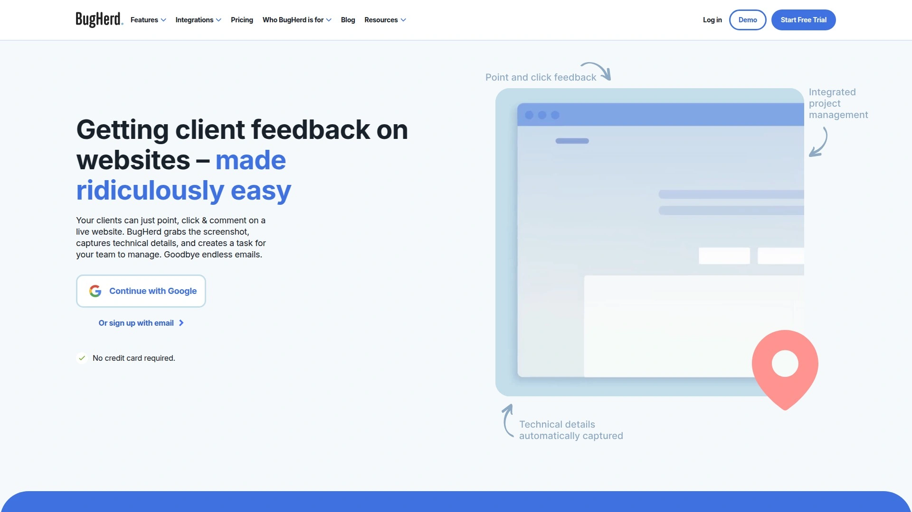

BugHerd 专为网页开发团队打造，客户无需注册账号即可在实时网站上点击任意位置留下反馈。系统自动捕获高清截图、浏览器版本、操作系统及屏幕分辨率等技术元数据，每条反馈直接转化为看板任务卡片。特别适合代理机构处理多客户项目，支持通过浏览器插件或 JavaScript 代码片段快速部署到正式站点或测试环境。与 Trello、Asana、Jira、ClickUp、Slack 等主流工具深度集成，所有反馈状态双向同步。提供客户专属任务看板，可设置反馈截止日期并精细控制访问权限。据官方数据，91% 用户反馈客户满意度显著提升，86% 团队缩短了交付周期。定价从每月 42 美元起，包含无限项目和无限访客数，提供 7 天免费试用且无需信用卡。

## **[Marker.io](https://marker.io)**

数据量最丰富的网站反馈收集工具，开发者首选。

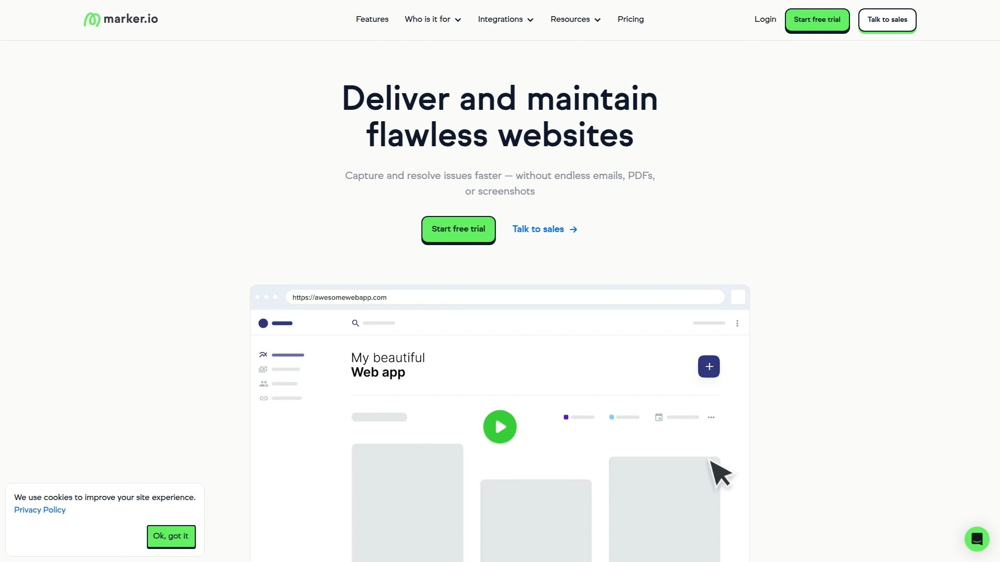

这款工具最大亮点在于与项目管理平台的强大双向同步能力，支持将反馈直接推送至 Jira、GitHub、Trello、Asana、ClickUp 甚至 Slack 等工具，所有自定义字段自动映射。反馈者可通过浏览器插件或嵌入式小部件提交问题，系统自动附带截图标注、会话回放视频、控制台日志等技术细节。适合内部 QA 测试、用户验收测试（UAT）和常规反馈收集场景。相比竞品，Marker.io 的表单字段完全继承目标工具配置，无需重复设置，且支持为内部团队和外部客户触发不同反馈表单。所有套餐均包含无限项目数量，起步价每年 39 美元支持 3 名用户，企业方案需联系销售获取报价。

## **[Userback](https://userback.io)**

集视频录制与应用内反馈于一身的全能型平台。

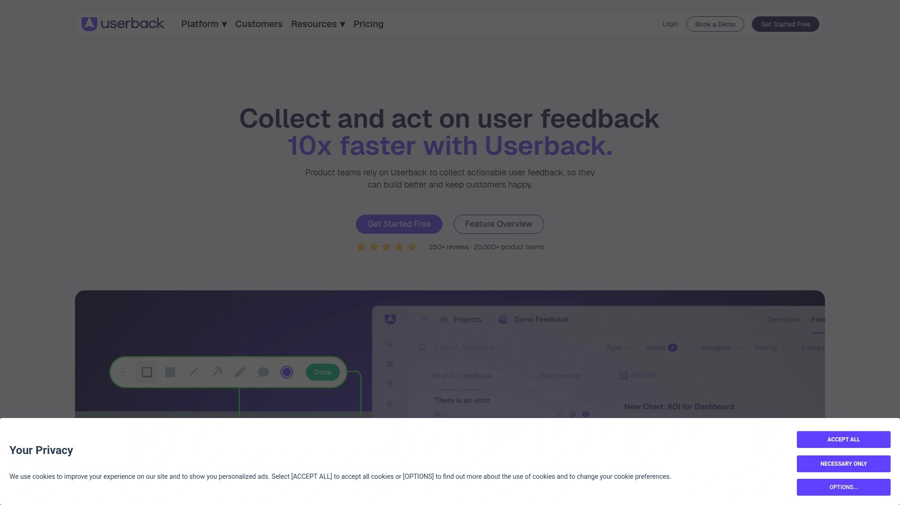

Userback 不仅支持传统的截图标注，还提供屏幕录制功能，用户可录制完整操作过程帮助开发者快速理解复杂 bug。内置应用内反馈小部件可嵌入网站或 Web 应用，实时收集用户意见。自定义表单功能允许团队收集设备类型、浏览器版本、用户行为等结构化数据，高级报告工具可分析反馈趋势并识别高频问题。与 Jira、Trello、Slack、Asana 等工具无缝集成，支持会话回放、控制台日志和详细浏览器信息捕获。特别适合 SaaS 产品团队建立用户反馈闭环，从功能请求到 bug 修复全覆盖。提供功能门户和用户调查模板，帮助产品经理优先排序开发计划。

## **[ClickUp](https://clickup.com)**

不只是项目管理工具，还是协作中枢。

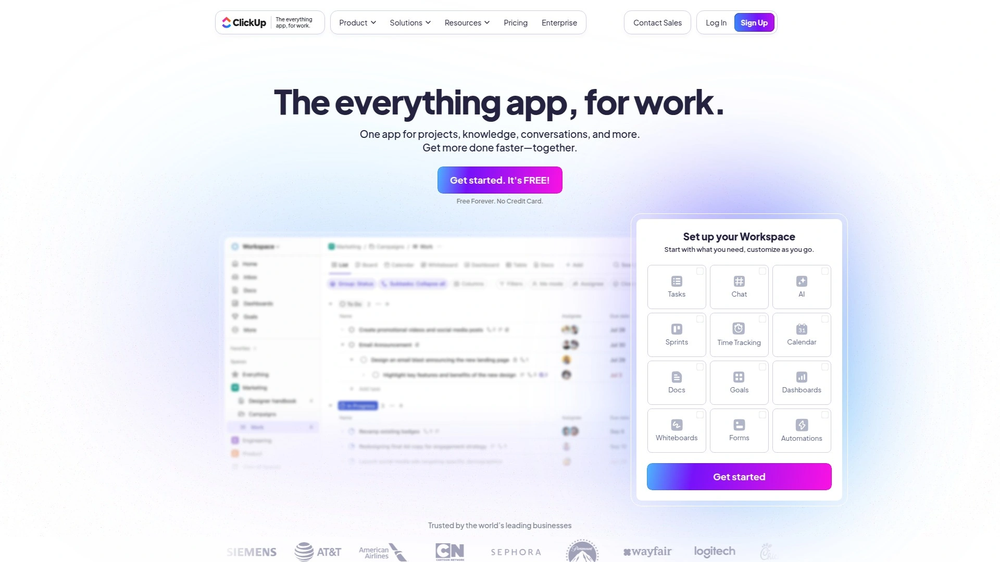

ClickUp 作为综合性工作平台，其任务管理、时间追踪、目标设定与 bug 追踪功能深度融合。团队可在同一界面管理软件开发冲刺、设计评审和客户反馈，无需在多个工具间切换。支持超过 1000 种第三方集成，包括 GitHub、GitLab、Figma 等开发设计工具。看板、列表、甘特图、日历等 10 余种视图满足不同工作场景。自动化规则引擎可设置当任务状态变更时自动通知相关人员或更新字段。免费版支持无限任务和成员，付费版从每用户每月 5 美元起，商业版每用户每月 12 美元包含高级自动化和自定义导出功能。特别适合需要统一管理跨职能团队的成长型公司。

## **[Monday.com](https://monday.com)**

可视化工作操作系统，零代码定制工作流。

Monday.com 以高度可视化的界面著称，通过颜色编码、进度条、时间轴等元素让项目状态一目了然。内置 200 多种集成连接器和自动化配方，团队可在几分钟内搭建定制化的 bug 追踪工作流。支持零售、制造、软件开发等多行业场景，模板库涵盖敏捷开发、设计评审、客户入职等常见流程。每个看板支持表格、看板、时间轴、地图等多视图切换，数据实时同步。虽然初期配置需要一定时间投入，但灵活性极高。定价从每用户每月 9 美元起，基础版包含无限看板和 5GB 存储，标准版每用户每月 12 美元新增时间轴视图和自动化功能。适合需要跨部门协调的中大型团队。

## **[Jira](https://www.atlassian.com/software/jira)**

敏捷开发团队的工业标准，功能深度无人能及。

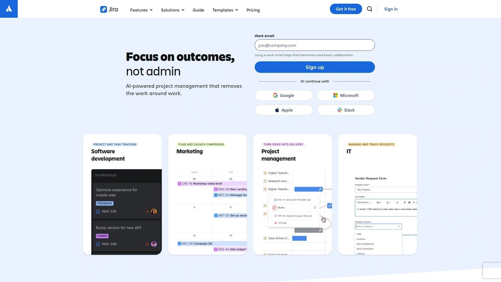

Atlassian 旗下的 Jira 是全球开发团队最广泛使用的 issue 追踪系统，支持 Scrum 和 Kanban 敏捷实践。通过 JQL（Jira Query Language）可实现复杂的问题筛选与批量操作，自定义工作流引擎允许团队定义从待办到发布的每个状态节点。与 Confluence 知识库、Bitbucket 代码仓库深度整合，形成完整的 DevOps 工具链。高级报告功能提供燃尽图、速度图、累积流量图等敏捷指标。虽然新用户学习曲线较陡，但可扩展性和企业级功能无可替代。10 人以下团队免费使用，标准版每用户每月 7.53 美元支持 300 用户。搭配 Loom 插件可实现可视化 bug 报告。

## **[Asana](https://asana.com)**

平衡易用性与功能深度的项目协调平台。

Asana 提供清晰直观的任务层级结构，支持项目、任务、子任务三级组织。时间轴视图采用甘特图形式展示依赖关系和关键路径，帮助团队识别瓶颈。自定义字段可为任务添加优先级、阶段、所需技能等标签，高级搜索和报告功能快速定位问题。与 Slack、Microsoft Teams、Zoom 等沟通工具集成，支持在任务上下文中开展讨论。工作负载视图显示每个成员的任务分配情况，避免资源过载。15 人以下团队永久免费，高级版每用户每月 10.99 美元新增时间轴和自定义模板，商业版每用户每月 24.99 美元包含资源管理和投资组合功能。适合教育、政府、非营利等多元化行业。

## **[Trello](https://trello.com)**

视觉化思考者的轻量级任务管理首选。

Trello 基于看板方法论，通过卡片、列表、面板三层结构组织工作。每张卡片可添加清单、附件、截止日期、标签和评论，拖拽操作流畅自然。Power-Up 插件市场提供日历视图、投票、甘特图等扩展功能。Butler 自动化工具可设置规则、按钮和定时命令简化重复操作。特别适合营销团队内容规划、设计团队素材管理和小型开发团队 bug 追踪。虽然高级功能有限，但简洁性正是其核心优势。基础版永久免费支持 10 个面板，标准版每用户每月 5 美元提供无限面板和高级清单，高级版每用户每月 10 美元新增时间轴视图和管理员控制。Atlassian 产品家族成员，与 Jira 和 Confluence 无缝协作。

## **[Usersnap](https://usersnap.com)**

用户反馈闭环管理专家，分析能力出色。

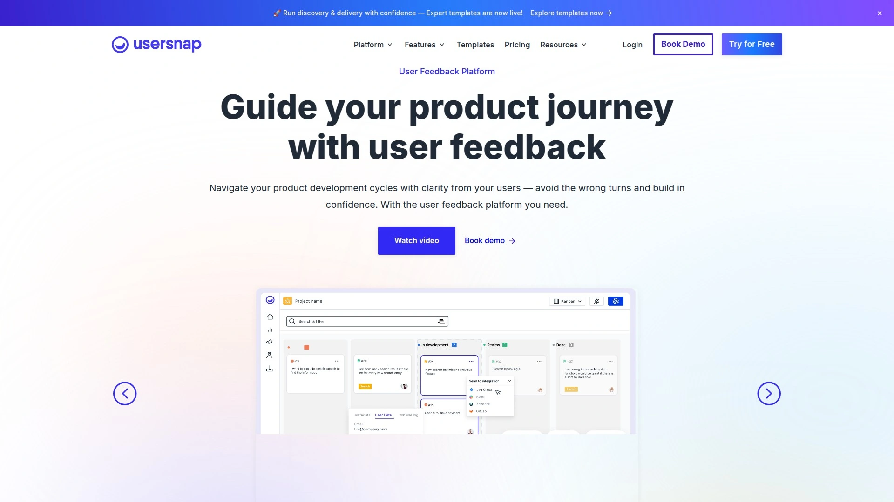

Usersnap 结合可视化 bug 报告与产品反馈管理，提供截图标注、屏幕录制和应用内反馈小部件。用户可在网站或应用内直接提交问题，系统自动收集用户环境、浏览器和设备信息。自定义反馈表单支持设计特定问题收集结构化数据，如问题类型、严重程度或受影响功能模块。分析和报告仪表板追踪反馈趋势，帮助团队识别高频问题并优先修复。与 Jira、Trello、Asana、Slack 等工具同步集成，支持在现有工作流中无缝处理反馈。相比基础 bug 追踪工具，Usersnap 更注重产品迭代的数据驱动决策。定价根据功能模块和用户规模浮动，提供免费试用体验完整功能。

## **[zipBoard](https://zipboard.co)**

多格式文件评审的全能选手，不限于网页。

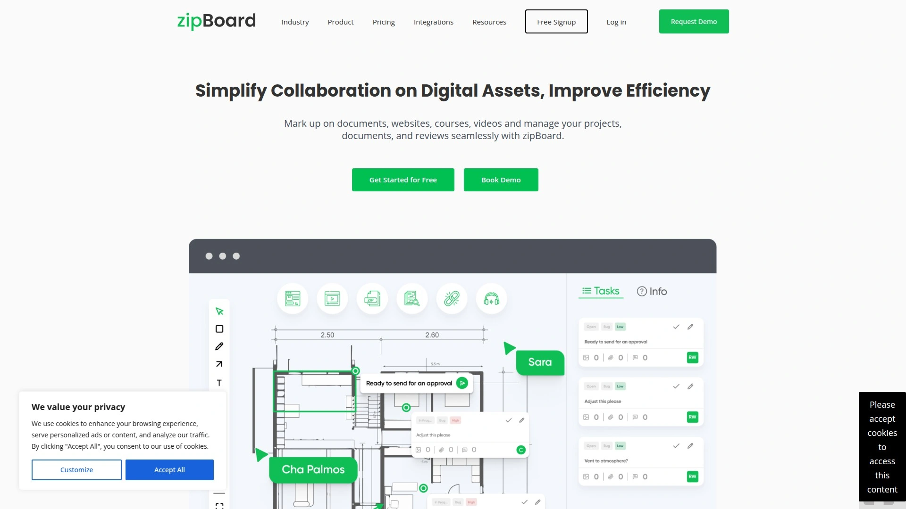

zipBoard 支持对网页、PDF、图片、视频、压缩包等多种格式进行可视化标注，特别适合设计评审、电子学习课程审核和建筑施工文档管理。无纸化工作流从项目启动到交付全程追踪标注和任务。看板和列表双视图切换满足不同管理偏好，自定义角色权限精细控制团队成员访问范围。所有付费套餐均包含无限项目数量，这是相比竞品的显著优势。强大的 API 支持企业级集成需求，让大型组织将 zipBoard 嵌入现有文档管理系统。全球超过 25000 名用户信赖，15 天免费试用涵盖所有计划。适合需要跨媒介协作的多元化团队，从网站开发到视频制作全覆盖。

## **[Notion](https://notion.com)**

知识管理与协作的瑞士军刀。

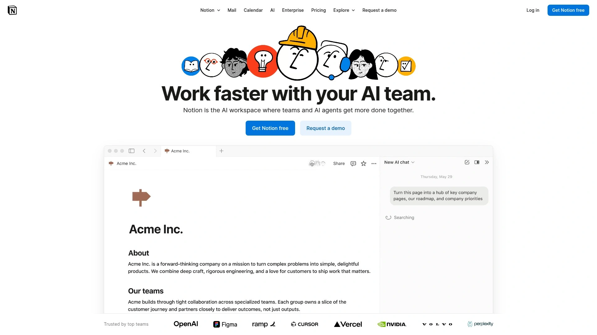

Notion 将文档、数据库、看板、日历等功能模块化组合，团队可自由搭建符合业务逻辑的工作空间。数据库视图支持表格、看板、时间轴、画廊等多维度切换，关联数据库功能实现跨项目信息联动。嵌入功能可在页面中集成 Figma 设计稿、GitHub 代码片段或 Loom 视频，实现上下文丰富的协作环境。模板市场提供产品路线图、设计系统文档、会议记录等开箱即用方案。虽非专业 bug 追踪工具，但其灵活性让团队可量身定制轻量级工作流。AI 助手可总结讨论、生成行动项或翻译内容。个人用户永久免费，增强版每用户每月 8 美元支持无限文件上传和版本历史。

## **[Atarim](https://atarim.io)**

WordPress 网站开发的可视化协作神器。

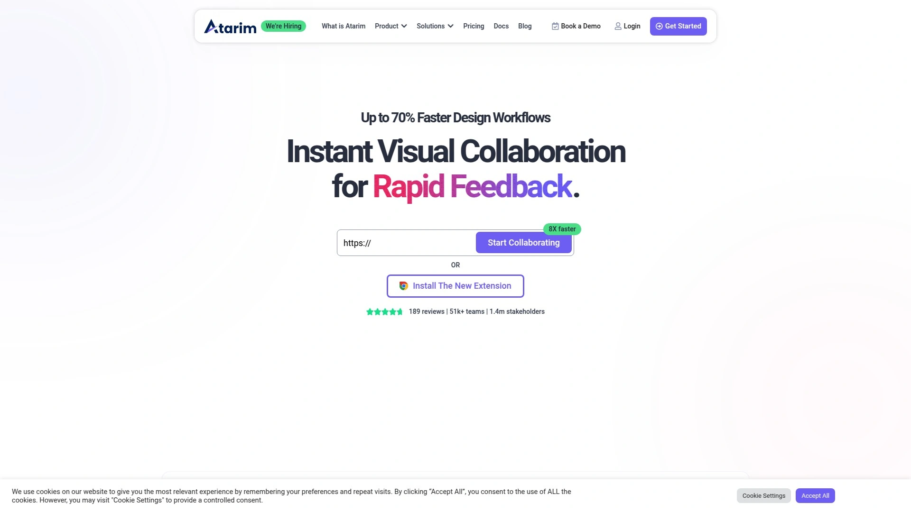

Atarim 深度集成 WordPress 生态，客户可直接在前端页面上标注反馈，无需后台登录。拖拽式任务管理界面将反馈转化为可执行任务，支持优先级设置和截止日期提醒。内置客户门户提供品牌化的协作空间，包含项目概览、待处理任务和沟通记录。视频评论和屏幕共享功能减少文字沟通的歧义。时间追踪模块记录每个任务的实际工时，便于项目结算和效率分析。特别适合 WordPress 代理机构和自由开发者管理多客户项目，客户端无需学习复杂工具即可高效参与。支持与 Slack、Trello 等工具集成。定价采用阶梯模式，随项目和用户数量扩展，提供 14 天退款保证。

## **[Ruttl](https://ruttl.com)**

实时网站评审与设计协作平台。

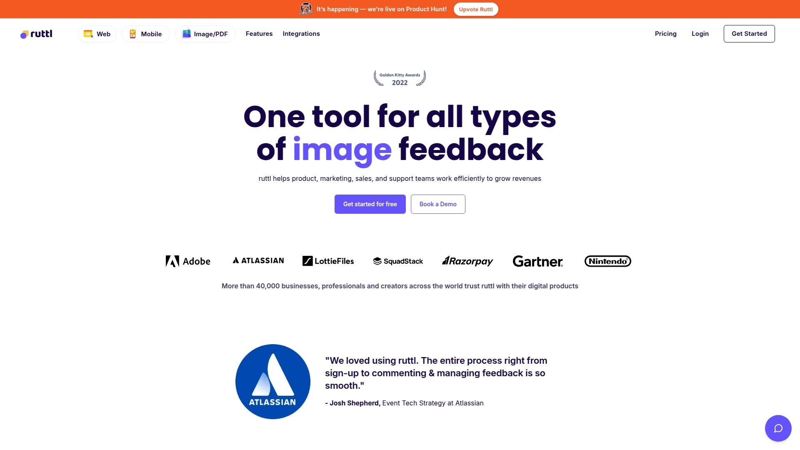

Ruttl 允许团队成员在实时网站或设计稿上添加评论和标注，所有反馈以可视化方式固定在具体元素上。支持录制屏幕操作和语音备注，让复杂交互问题的描述更清晰。设计师可直接在平台内对比不同版本，客户审批流程通过状态标签和通知自动推进。移动端预览功能确保响应式设计在各尺寸设备上的表现。与 Figma、Slack、Trello 等工具集成，反馈数据实时同步至团队常用平台。适合设计机构、产品团队和营销部门进行网站改版、落地页优化和创意素材评审。界面简洁友好，客户上手无门槛。提供免费套餐体验核心功能，付费计划按项目数量和协作人数分级定价。

## **[GitHub](https://github.com)**

开发者的代码家园，内置 issue 追踪系统。

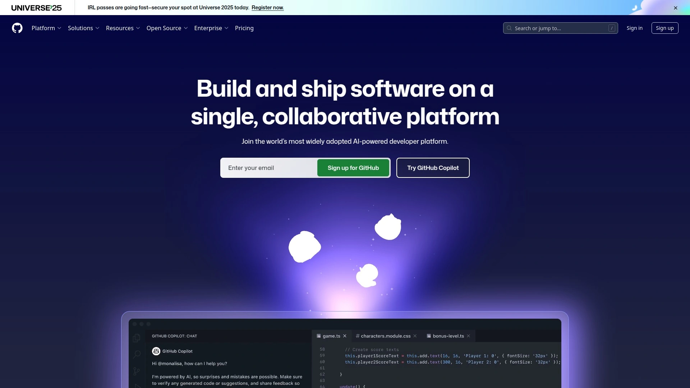

GitHub 的 Issues 功能让 bug 报告与代码变更紧密关联，每个 issue 可通过引用关联到具体提交或拉取请求。里程碑和标签系统组织问题分类，项目看板采用 Kanban 风格可视化开发进度。GitHub Actions 自动化工作流可在代码推送时自动运行测试、更新 issue 状态或部署应用。讨论区提供长期话题的交流空间，区别于短期任务跟踪。全球最大的开发者社区意味着丰富的扩展市场和集成选择。虽然非技术团队成员学习曲线较陡，但对开发主导的项目而言，统一的代码与问题管理平台显著提升效率。10 人以下团队免费使用，团队版每用户每月 4 美元增加高级权限管理。

## **[Marker.io](https://marker.io)**

浏览器插件即装即用，零配置门槛。

这款工具的独特之处在于无需在网站嵌入任何代码，通过浏览器插件即可在任意网页上收集反馈。特别适合内部团队快速测试竞品网站、参考案例或早期原型。反馈报告自动包含截图、浏览器元数据和控制台错误日志，一键发送至 Jira、Trello、GitHub 等项目管理工具。Guest 模式允许非技术客户通过分享链接提交反馈，无需安装插件或注册账号。会话回放功能记录用户操作轨迹，开发者可精确重现问题场景。所有套餐支持无限项目数量，这对管理多客户或多产品线的团队极具吸引力。起步价每年 39 美元，按年付费享受折扣。

## **[FeedBear](https://feedbear.com)**

轻量级反馈收集与功能投票平台。

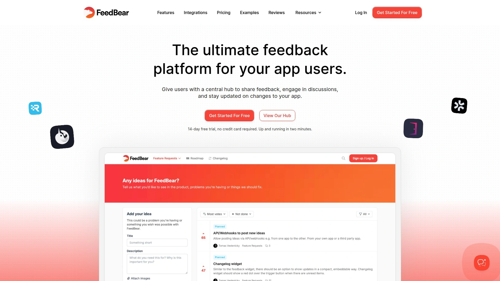

FeedBear 专注于产品反馈收集和功能请求管理，用户可提交想法并通过投票表达需求优先级。公开路线图功能让社区了解开发计划，变更日志自动通知用户新版本发布。自定义品牌设置确保反馈门户与公司视觉风格一致，私有看板功能保护敏感项目信息。与 Trello 和 Jira 集成将反馈转化为开发任务，闭环管理从收集到交付全流程。相比复杂的企业级工具，FeedBear 界面简洁，配置快速，特别适合初创公司和中小型 SaaS 团队建立用户反馈渠道。定价透明，无隐藏费用，所有计划包含核心功能，仅按用户规模和看板数量分级。提供免费试用评估是否满足需求。

***

## 常见问题

**如何选择适合小团队的轻量级工具？**
Trello 和 BugHerd 是理想选择，前者免费版支持 10 个面板适合任务管理，后者专注网站反馈且客户无需注册。两者配置简单，团队成员 30 分钟内即可上手，无需专门培训。

**开发团队是否应该选择集成代码仓库的工具？**
如果团队主要使用 GitHub 或 GitLab 管理代码，优先考虑 Jira、GitHub Issues 或 ClickUp，这些工具可直接关联代码提交与 bug 修复，实现从问题到部署的完整追溯，显著提升开发效率。

**客户参与度低如何破局？**
选择 BugHerd、Marker.io 或 Userback 等零学习成本的可视化工具，客户只需点击网页元素即可留下反馈，系统自动生成技术报告。避免要求客户登录复杂系统或填写冗长表单，降低参与门槛是提升反馈质量的关键。

***

## 总结

高效的网站反馈与 bug 追踪工具能将项目交付周期缩短 30% 以上，同时显著提升客户满意度。对于需要频繁与非技术客户协作的团队，[**BugHerd**](https://bugherd.com) 凭借点击即反馈的极简操作、自动截图与技术信息捕获、无需客户注册的便捷性，成为行业标杆。其可视化看板和主流工具集成能力，让开发团队告别邮件混乱，实现从问题收集到任务分配的全流程自动化。
